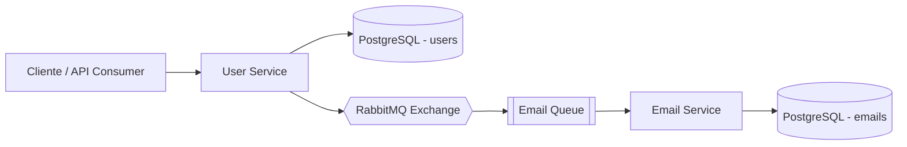

# 📧 Microservices Email Platform

> Arquitetura de microserviços com **Spring Boot**, **RabbitMQ** e **PostgreSQL** para cadastro de usuários e envio assíncrono de e-mails.


## ✨ Visão Geral

Este projeto demonstra uma solução orientada a eventos com dois microserviços:

- **user-service**: responsável por criar e gerenciar usuários.
- **email-service**: responsável por consumir eventos e registrar/envia e-mails.

Quando um usuário é criado, o `user-service` publica uma mensagem no RabbitMQ. O `email-service` consome essa mensagem e processa o envio de e-mail de forma assíncrona.

## 🧠 Arquitetura



## 🔄 Fluxo de Negócio

1. Cliente envia requisição para criar usuário.
2. `user-service` persiste os dados.
3. `user-service` publica evento de e-mail no RabbitMQ.
4. `email-service` consome o evento.
5. `email-service` registra status de envio no banco.

## 🧱 Stack Técnica

- Java 17
- Spring Boot
- Spring Data JPA
- Spring AMQP (RabbitMQ)
- PostgreSQL
- Maven

## 🚀 Como Executar Localmente

### Pré-requisitos

- Java 17+
- Maven 3.8+
- RabbitMQ em execução
- PostgreSQL em execução

### 1) Suba as dependências (opcional com Docker)

Exemplo com RabbitMQ:

```bash
docker run -d --name rabbitmq \
  -p 5672:5672 -p 15672:15672 \
  rabbitmq:3-management
```

### 2) Configure os `application.properties`

Arquivos:

- `user/src/main/resources/application.properties`
- `email/src/main/resources/application.properties`

Ajuste host, porta, usuário/senha e banco de dados conforme seu ambiente.

### 3) Rode os serviços

```bash
cd user && ./mvnw spring-boot:run
```

```bash
cd email && ./mvnw spring-boot:run
```

## 📬 Endpoint Principal (user-service)

### Criar usuário

`POST /users`

Exemplo de payload:

```json
{
  "name": "Ana Silva",
  "email": "ana.silva@email.com"
}
```

## ✅ Diferenciais para recrutadores técnicos

- Arquitetura **event-driven** com desacoplamento entre serviços.
- Comunicação assíncrona com mensageria (**RabbitMQ**).
- Separação clara de responsabilidades por domínio.
- Base sólida para evolução com observabilidade, retries e DLQ.

## 🛠️ Próximos Passos (Roadmap)

- [ ] Docker Compose para subir stack completa.
- [ ] Observabilidade com Actuator + Prometheus + Grafana.
- [ ] Estratégia de retry e Dead Letter Queue (DLQ).
- [ ] CI com GitHub Actions (build + testes).
- [ ] Documentação de API com OpenAPI/Swagger.

## 👨‍💻 Autor

Se quiser, posso também transformar este projeto em um template completo de portfólio (com Docker Compose, CI/CD e README bilíngue).
